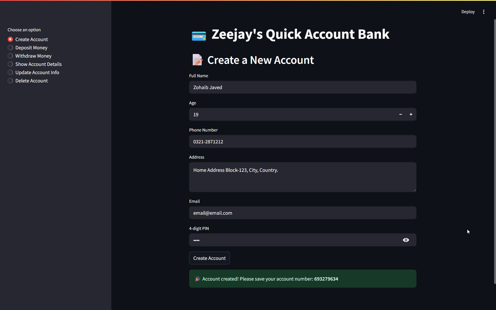
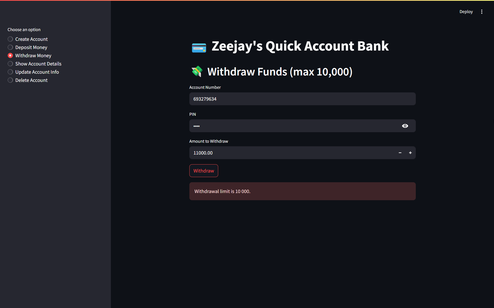
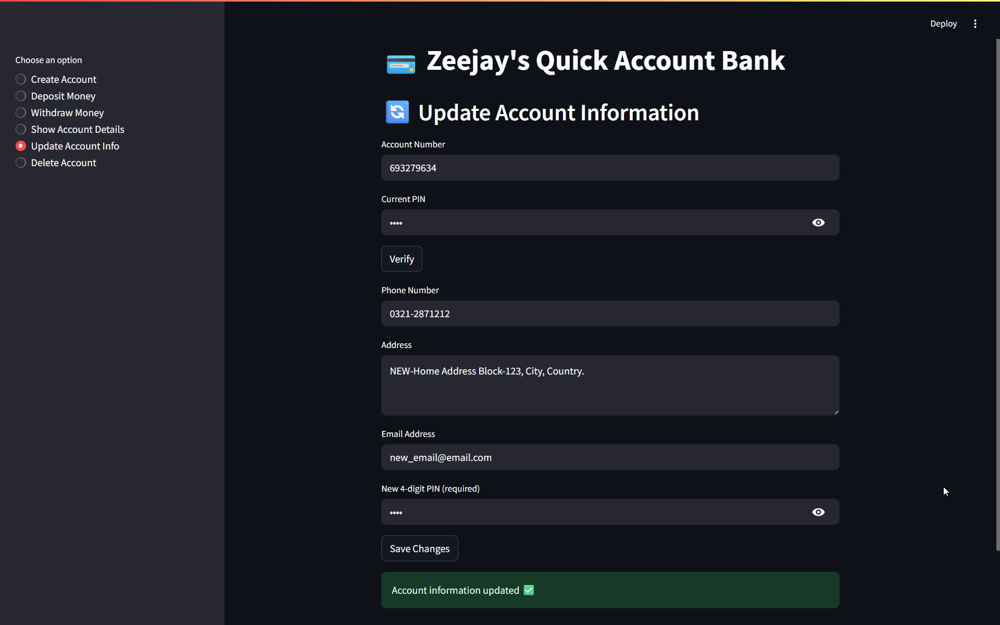

# 💳 Zeejay's Quick Account Bank

A fully interactive banking app built using **Python** and **Streamlit**, designed to simulate real-world banking operations like:

- 🔐 Account Creation  
- 💰 Deposits & Withdrawals  
- 📋 Account Detail Viewing  
- ✏️ Secure Account Updates  
- ❌ Account Deletion  

All while demonstrating core **Object-Oriented Programming (OOP)** principles in the backend design.

---

## 🚀 Live Demo

🌐 **Live App**: _[(https://zohaib-javd-quick-account-bank-app-bank-app-hf5ipm.streamlit.app/)]_  
📸 **Screenshots** 
- 
- 
- 

---

## 🧠 Features

| Feature                | Description                               |
|------------------------|-------------------------------------------|
| Create Account         | Name, age, phone, address, email, PIN     |
| Deposit Money          | No upper limit                            |
| Withdraw Money         | Limit: 10,000                             |
| Show Account Details   | Secure PIN-protected summary              |
| Update Info            | Change phone, address, email, PIN only    |
| Delete Account         | Securely delete account via verification  |
| Error Handling         | PIN format checks, validation alerts      |
| Session State          | Used for update verification              |

---

## 🧰 Tech Stack

- **Python** – Logic & data handling
- **Streamlit** – UI framework
- **JSON** – Local database
- **Session State** – To handle multi-step flows

---

## 👨‍🏫 OOP Concepts Applied

While the Streamlit version is UI-centric, the backend (`main.py`) was written with strong OOP practices:

### ✅ Classes & Objects
```python
class Bank:
    def __init__(self):
        self.data = []
```

### ✅ Encapsulation
- Internal methods like `__update()` and `__accountgenerate()` handle logic privately.

### ✅ Abstraction
- Public methods like `.Createaccount()` hide storage logic & user checks.

### ✅ Inheritance (Planned)
Future version will split users (Admin, Customer) via inheritance.

---

## 🏗 Project Structure

```
📦 zeejay-bank
┣ 📜 bank_app.py        → Streamlit App
┣ 📜 data.json           → JSON-based database
┣ 📁 image/        
┗ 📜 README.md
```

---

## 🛠 Installation & Run

```bash
git clone https://github.com/zohaib-javd/quick-account-bank-app.git
cd zeejay-bank
pip install streamlit
streamlit run bank_app.py
```

---

## 📲 Connect with me:

🔗 [LinkedIn](https://www.linkedin.com/in/zohaib-javd)  
📧 zohaibjaved@gmail.com  
❎ [X (Twitter)](https://x.com/zohaibjaved)

---

## 📌 Notes

- Uses no external DB or login system — perfect for local projects & demos  
- Extendable to Firebase/PostgreSQL/Supabase  
- Future version will include role-based login & transaction history

---

> Built by Zohaib Javed 
